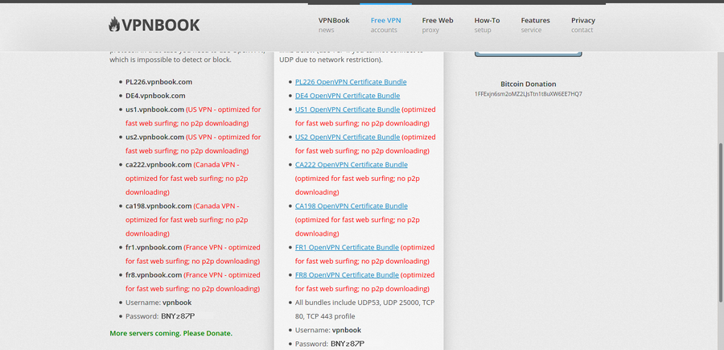
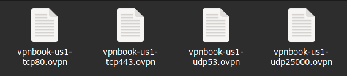
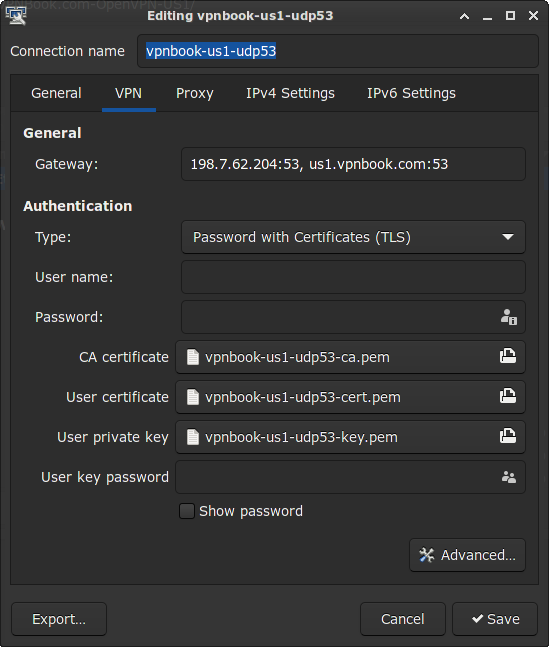

OpenVPN is an open-source Virtual Private Network (VPN) system that implements techniques to create secure point-to-point or site-to-site connections in routed or bridged configurations and remote access facilities. It allows peers to authenticate each other using pre-shared secret keys, certificates, or usernames/passwords. It is recognized industry-wide as the most secure VPN encryption protocol. As well as being remarkably reliable, OpenVPN is highly customizable and can be implemented by users in several ways.

The OpenVPN protocol is responsible for handling client-server communications. It allows you to connect to a remote network over a secure, encrypted connection and mask your IP addresses over all ports. When OpenVPN handles encryption and authentication, it uses the OpenSSL library extensively.

Setting up OpenVPN in Linux is pretty straightforward. Specifically, You can import its configuration from the NetworkManager, *nm-connection-editor*. The structure of OpenVPN has a .openvpn extension. I want this blog to be a hands-on tutorial on how to import it. So, let's get started.

First of all, you should download the OpenVPN configuration. It can be downloaded from any service provider, but I will use the [vpnbook](https://www.vpnbook.com/freevpn) for this blog for simplicity.

The above picture is the screenshot of the link to the vpnbook website. Download any OpenVPN Certificate Bundle from the provided ones according to your location and need. I downloaded [US1 OpenVPN Certificate Bundle](https://www.vpnbook.com/free-openvpn-account/VPNBook.com-OpenVPN-US1.zip). Now let's go ahead and look at the contents of the zip file you just downloaded.

The zip contained the files shown in the figure above. The vpnbook website says they are *UDP 53*, *UDP 25000*, *TCP 80*, and *TCP 443* profiles. TCP and UDP are protocols for those who don't know about them; the numbers beside them are the port in which they operate. For example, vpnbook-us1-udp53.openvpn has a configuration for UDP protocol on port 53 for the VPN.

Now let's go ahead and import them from the NetworkManager. But hold on, have you installed the OpenVPN client needed to operate it? If not, install the *openvpn* package required for OpenVPN. Since we will import them from the NetworkManager, we need a networkmanager-openvpn plugin. Depending on your Linux distribution, the package name may differ slightly and have been included in the *networkmanager* package. Since I am on Arch (I use Arch, btw! 😜), those package names belong to Arch. So, go ahead and do some research for your distribution and install those prerequisites.

We will be importing the configuration from the *nm-connection-editor* command. It is a NetworkManager GUI connection editor. So, go ahead and enter *nm-connection-editor* in your terminal, or if you are not a fan of entering commands in the terminal, right-click your NetworkManager applet from your taskbar and click on *Edit Connections…*. Now, you will see a window showing your previous network connections. Click the **+** icon on the bottom left corner to add a connection.

You'll be prompted to choose a connection type from the dropdown, which will default to *Ethernet*. Choose "Import a saved VPN configuration," **not VPN**, the last element in the dropdown in my case. Then click *Create*. This also shows a quick reminder to install the openvpn plugin for NetworkManager if you haven't already.

After clicking *Create*, you will be prompted to choose the OpenVPN configuration file. Go ahead and show it the .openvpn file of your choice. Quick info: **UDP is faster but can result in data loss, and TCP is more reliable**. The Vpnbook instructs you to use TCP if you cannot connect to UDP due to network restrictions. I am choosing vpnbook-us1-udp53.openvpn and importing it. However, you can import any one of the four files.

As you can see, the NetworkManager automatically imports your settings; You don't have to manually type it. The configuration just imported had a key and a certificate inside it. So the network manager created them inside the .cert directory in your $HOME directory. If you have a different file for your certificate and/or key, then NetworkManager imports it/them in the configuration. But it would help if you didn't move them since it stores their location there. Suppose you move any of those files. In that case, you must update their path in this configuration in *nm-connection-editor*.

Every OpenVPN service you use has a username and password associated with your account. Since the vpnbook has a common username and password for all the users, its username remains the same but its password changes from time to time. So if you are using the vpnbook and cannot connect to the VPN service, the chances are the password has been changed. Now go ahead and copy the username and password from the [vpnbook](https://www.vpnbook.com/freevpn) and paste it into the configuration above. You can change the *Connection name* if you like, but you should only alter other fields if you know what you are exactly doing. Hit *Save* when you are done.

Now when you click on the network manager applet on the taskbar, you can see the connection name for the VPN set above inside *VPN Connections*. Click on the VPN you want to activate. The network manager tries to connect you to the VPN selected. The icon of the network manager applet also changes.

The [vpnbook](https://www.vpnbook.com/freevpn) was chosen in this tutorial for simplicity. It is free for everyone, so it could be more active, and you might not have established a successful VPN connection due to this. You can try again if it doesn't connect for the first time.

I have imported the [TunnelBear OpenVPN config files](https://s3.amazonaws.com/tunnelbear/linux/openvpn.zip) in the same way as above. For username and password, you must enter the email and password you used when creating an account on [TunnelBear](https://www.tunnelbear.com/). It gives you a 500MB network transfer per month for free package users. For more, you have to pay for them.

You can also set up OpenVPN by moving the files to /etc/openvpn/client and starting the openvpn service from the command line. More about the process [here](https://wiki.archlinux.org/index.php/TunnelBear). But I'm not particularly eager to use root access if any user can. The method described in this blog works for users without superuser privileges also. The only place where superuser privileges are required is when installing the prerequisite packages.

So that's all for today. Let me know your views and reactions in the comments below.