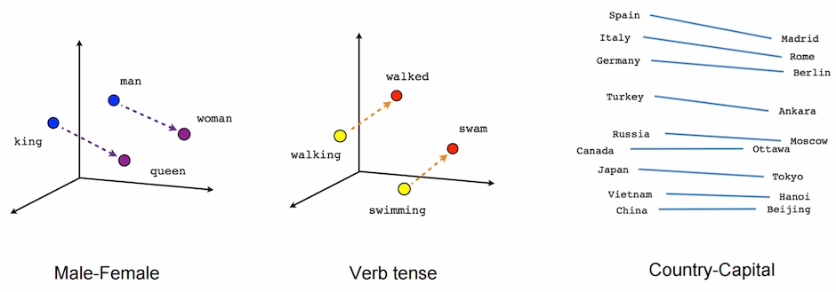
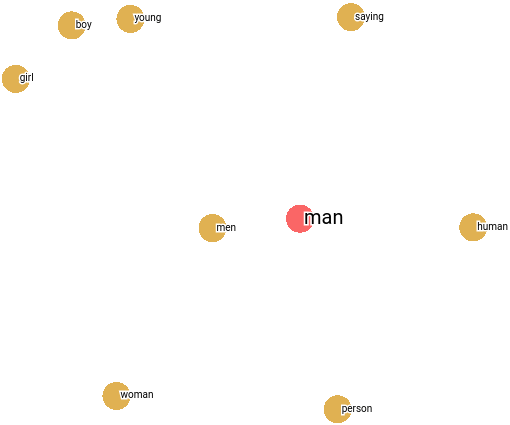

## Tokenization

Since the computer doesn't understand strings as numerical values, they must be converted into numeric forms. So the sentences used for training are converted into sequence tokens utilizing some tokenizer. Converting a text into a sequence of tokens is called tokenization. Tokenization can be broadly classified into 3 types: word, character, and subword (n-gram characters).

### Word Tokenizer

Word tokenizers tokenize each word separately by splitting the sentence with spaces. But soon enough, we find out that they could better capture the relationship between the words. "Don't" and "Do not" are the same for us as humans but not for the tokenizer, which may result in different meanings for these words to the model. To overcome this kind of problem, different rules started to be used to separate text into tokens. Depending on the rules we apply to split our texts into tokens, we'll get different tokenized versions of the exact text. So the pre-trained model will only perform well if the same rules used to pre-train them are used when evaluating or fine-tuning them.

Another drawback of this method is the vocabulary associated with it. An increase in vocabulary means an increase in the size of the embedding matrix, which causes colossal memory consumption.

### Character Tokenizer

Character tokenizers tokenize each character as a token. Its main advantages are simplicity, speed, and less memory use than word tokenizers. But this doesn't allow the model to capture long-term dependencies in a sentence and performs poorly. The model fails to learn a representation of texts as meaningful as when using a word tokenization.

### Sub-word Tokenizer

Sub-word tokenizers are used to get the best of both word-level and character-level tokenizers. They use less memory than word-level tokenizers and help capture a more meaningful representation of texts than character-level tokenizers.

Old language models based on word-level tokenization learned the relationship between words from the same stem-like "big," "bigger," and "biggest," from their word embedding built from the provided corpus. Still, they couldn't generalize the learned dimension to similar word vectors like "old," "older," and "oldest." If we learned to differentiate the stem word from the words, then the effect of the same suffix or prefix is also similar in the case of other words. Sub-word tokenization addresses this problem to a certain extent. This keeps the exact representation for the familiar words but breaks the rate words into sub-word tokens.

Different sub-word tokenizers currently being used in the NLP field are described below.

#### Byte Pair Encoding (BPE)

Byte Pair Encoding, or diagram coding, is a simple form of lossless data compression in which the most common pair of consecutive bytes of data is replaced with a byte different from the ones originally in the data or corpus of texts. A variant of this technique is used in various state-of-the-art natural language processing applications, like Transformers and OpenAI's GPT, GPT-2, and GPT-3. The Wikipedia article Byte Pair Encoding provides an excellent example of encoding a word with byte pair encoding.

Byte pair encoding is a sub-word tokenizer used to make parts of words as a token rather than treating a single word as a token. When we have a corpus of text and need to build a byte pair encoder, we start by appending a unique token like </w> to the end of each token to mark the end of words since our tokens are subwords. We build a dictionary of the frequency of words to count the frequency of different byte pairs. We start by splitting words into letters and assigning them unique tokens, which will be stored in a dictionary, making each word a sequence of tokens with each token of a single character. We find the most frequent consecutive character tokens and replace them with a new token. This continues until no consecutive tokens are repeated in the corpus more than once. This can also be controlled by setting the maximum sub-word length and maximum iteration to continue the above process. Practically, during the above recursive function, the number of tokens increases first and then starts to decrease. The source code of doing byte pair encoding for a corpus of code can be found in [Unsupervised Word Segmentation for Neural Machine Translation and Text Generation](https://github.com/rsennrich/subword-nmt), used in the paper [Neural Machine Translation of Rare Words with Subword Units](https://arxiv.org/abs/1508.07909).

Another advantage of this method is that this generalizes better than word tokenizer to out-of-vocabulary words. It splits the out-of-vocabulary words into a token of subwords with maximum length lying in the given word. An out-of-vocabulary word like transformer can be encoded to \["trans," "former," "</w>"] if it had seen "trans" and "former" previously. But suppose we remove infrequent tokens to reduce the vocabulary size and don't have all the characters from which our corpus is built. In that case, tokenized texts contain another unique token called <oov> or <unk>, which stands for out of vocabulary and unknown tokens. For example, if "h" is not in our vocabulary, "hype" may be tokenized as ["<oov>," "ype"]. Practically, this happens mainly to special characters like emojis and may occur more in non-English languages.

#### Byte-level BPE

The base characters for the vocabulary can be prominent if we incorporate all the Unicode characters. The problem of tokenizing texts with <oov> tokens is more pronounced in a non-English language. Byte-level BPE is a clever tweak of its predecessor BPE in which bytes are included in the base vocabulary. Since a byte consists of 8 bits, 28, i.e., 256 combinations of words, are included in the base vocabulary. This helps to tokenize every text without needing an out-of-vocabulary token. This clever trick was proposed in [GPT-2 Paper](https://openai.com/blog/better-language-models/).

#### WordPiece

WordPiece is a sub-word tokenization algorithm used in language representation models like [BERT](https://arxiv.org/abs/1810.04805) and was outlined in the [JAPANESE AND KOREAN VOICE SEARCH](https://static.googleusercontent.com/media/research.google.com/ja//pubs/archive/37842.pdf) paper.

It relies on the same base as BPE, initializing the vocabulary to every character in the corpus and progressively learning some merge rules. The difference is in choosing the tokens to be merged. BPE picks the most frequent pair of tokens to be substituted with a new one. In contrast, WordPiece chooses the pair that will maximize the likelihood of the corpus once merged. initializing 

Mathematically speaking, if P(X) is the probability of occurring a token X in the corpus, BPE chooses the pair yz with the maximum probability of P(yz). In contrast, WordPiece chooses a pair yz with a maximum conditional probability of P(yz|y,z), which is the probability of getting a yz pair given that the tokens y and z occur. In layperson's terms, it evaluates what it loses by merging two symbols and ensuring it's worth it. It focuses more on rare sub-word tokens.

#### SentencePiece

All the tokenizing methods discussed above required some pre-tokenization. Those methods act like sub-word tokenizers, which must know what words are. Since some languages, like Chinese, Japanese, Thai, etc., don't use spaces to separate words, the above methods cannot be used in those languages.

[SentencePiece](https://arxiv.org/abs/1808.06226) introduces a novel technique for tokenization. It treats the input as a raw stream, i.e., sentence as a whole rather than a collection of words, and includes space in the set of characters to use. It then uses BPE or unigram to construct the appropriate vocabulary.

The implementation of this algorithm commonly represents a space character as a \_ character. So we may find different tokens with \_ in them. The models like XLM described in [Cross-lingual Language Model Pretraining](https://arxiv.org/abs/1901.07291) used this tokenization. This is considered to be the state-of-the-art tokenizer at the time of writing this document.

## One-Hot Encoding

Since tokens are just numbers, they might represent a token of higher importance than others. So they need to be converted into a one-hot vector. One-hot vectors are those vectors in which only one component of the vector is hot (one), and all the other components are zero. But the problem with the one-hot vector is that their dimension is equal to the vocabulary size of the corpus, which can be pretty substantial. Also, since the vectors are one-hot encoded, they are all perpendicular. So there is no sense of similarity between them.

## Word Embedding

People started to search for a method to compress the one-hot vector to save space and provide a sense of similarity between the word vectors. In lay terms, word embedding is a learned representation of text where words with similar meanings are similar.

The tokens are passed from the tokenizer to the model, which then picks up a vector of a predefined dimension unique to each token from an embedding matrix. The embedding matrix has one dimension to be the vocabulary size and another to, the embedding size. The embedding size is the dimension of each dense vector representing a token. The more the dimension, the more similarities can be captured between the words. But generally, 300-dimensional embedding is sufficient to capture the similarities of the word vectors.

Dense vectors, also known as embeddings, for different words, are compared using distance metrics like cosine, euclidean distance, etc., to find their similarities. Due to the word embeddings, the effect of swapping a word with a similar word is almost identical to the model. Word embeddings can capture the syntactic and semantic similarity between words. **Syntactic similarity** refers to the grammatical structure of the terms. In contrast, semantic **similarity** refers to the similarity in the words' meaning and interpretation. This enables the model to answer, "Man is to a king as woman is to what?". Answering these questions successfully means that the model could find their semantic similarities. This particular example tells us that the embedding of the learned vectors was able to find a dimension corresponding to "royalness."

For illustration, the embeddings produced by [word2vec](https://arxiv.org/abs/1301.3781) are similar to the one below. The figure shows that the resulting vector from *king-man+woman* doesn't precisely equal *queen*. Still, the queen is the closest word to it from all the other word embeddings in the corpus.

")

Embeddings capture the direction of different things like gender, tense, etc. Since the bases are not predefined, certain combinations of the learned bases represent different quantities. The figure below helps to understand this concept more clearly.

Since the embeddings are vectors in a higher dimension and show the similarities between the words, they can be projected down to 2D or 3D space using various techniques like [UMAP: Uniform Manifold Approximation and Projection for Dimension Reduction](https://umap-learn.readthedocs.io/en/latest/), [t-distributed stochastic neighbor embedding](https://en.wikipedia.org/wiki/T-distributed_stochastic_neighbor_embedding), [Principal Component Analysis (PCA)](https://en.wikipedia.org/wiki/Principal_component_analysis), etc. according to the need. The projections of common embeddings can be found in [Embedding projector - visualization of high-dimensional data](https://projector.tensorflow.org/) where you can upload your custom embeddings too. A sample image showing the nearest ten points of word *man* for the *Word2Vec 10K* model in terms of cosine similarity, projected to 2D space using PCA and sphering the data, is shown below.

Since the word embeddings are built solely upon the data seen by the model, they may contain biases in terms of race and gender, as described in [Man is to Computer Programmer as Woman is to Homemaker? Debiasing Word Embeddings](https://arxiv.org/abs/1607.06520). The embeddings should be debiased before taking the model into production.

## Training Word Embeddings

Each token picks up a randomly initialized vector from the embedding matrix using its unique index, and the loss of the model is backpropagated to update the vectors and, ultimately, the matrix. When the training is complete, the embedding matrix contains dense vectors for each token which can be used to make different interpretations of the model and the particular task on which the model was trained.

Word embeddings are generally trained for a particular task. The word embedding for classifying the text can differ from generating alt text for the images. Pre-trained word embedding can also be used and fine-tuned for the specific task. Since the pre-trained embeddings have more vocab size than text available for the particular job, they help even when we get the words not present in the training data while testing. Those pre-trained embeddings are trained unsupervised to preserve the context of the text in which they are trained and maximize the likelihood of the sentences in the training set.

## References and Further Readings

* [Summary of the Tokenizers - Hugging Face](https://huggingface.co/transformers/tokenizer_summary.html)
* [The Illustrated Word2vec - Jay Alammar](https://jalammar.github.io/illustrated-word2vec/)

So that's it for today. Let me know your views and reactions in the comments below.